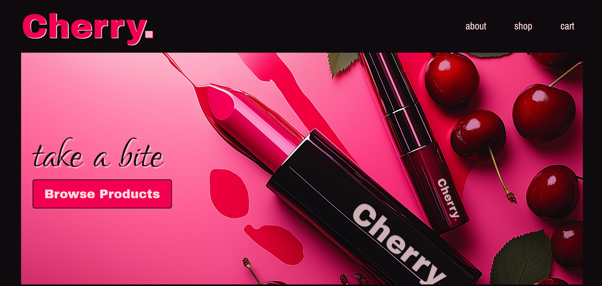

# Cherry 🍒

## Overview

Cherry is an online e-commerce store specialising in make-up and fragrance. It offers a easy shopping experience through a custom WordPress theme built using PHP and CSS, with the integration of the WooCommerce plugin to manage and showcase the product catalog.

## Screenshot

  

## Link to deployed site

[https://cherry-beauty.com](https://cherrry.online)

## Technologies Used

- 
- 
- 
- 